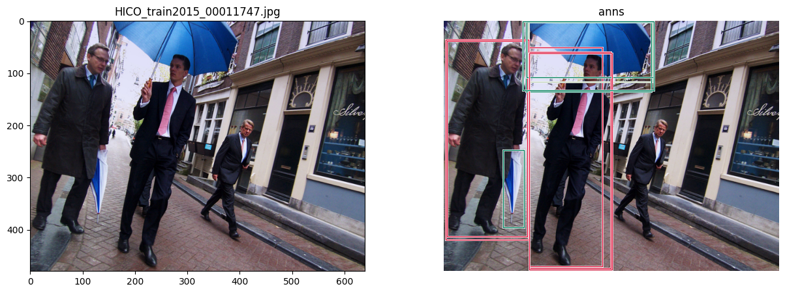
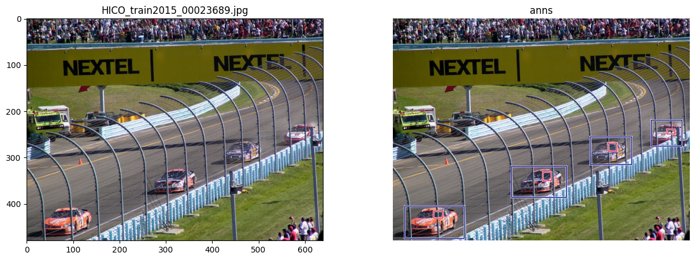
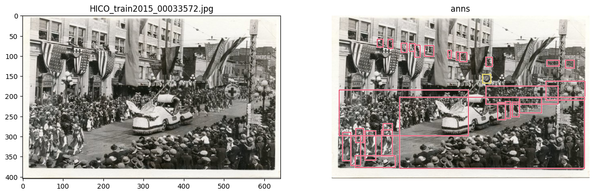
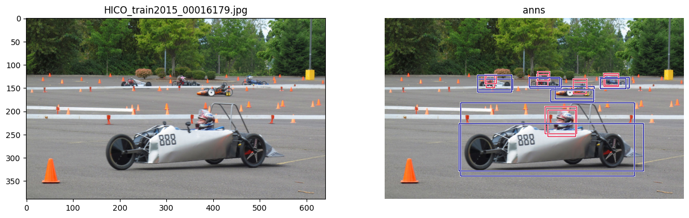
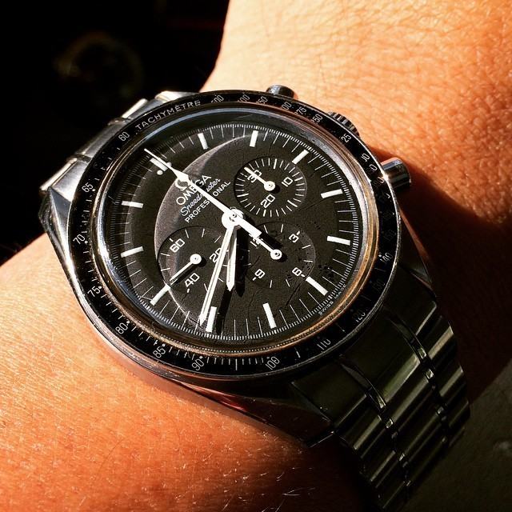

# hico-det

# 主要特性

转换为COCO格式的HICODET数据集标注，可用pycocotools.coco.COCO加载。

本仓库仅包含标注，图片下载前往文末[引用](#引用)。

ann_id遵循原本标注，但在[label_info.json](configs/label_info.json)中为其配置了valid_id，按照以下规则重新排列：

1. is not bg_verb
2. obj_name
3. verb_name

仅为了优化打印成表格后的视觉效果。

# 数据特性

- hoi: 600 (triplet)
- rel: 117
- obj: 80 (coco-ins)
- pasta(optional): [PaStaNet/HAKE](http://hake-mvig.cn/)

# 标注格式
## image
```json
{
    'info': [], 
    'licenses': [], 
    'images': [
        {
            'file_name': 'HICO_test2015_00000001.jpg',
            'height'   : 427,
            'width'    : 640,
            'id'       : 1
        },
        ...
    ]
}
```

## instance
```json
{
    'info': [], 
    'licenses': [], 
    'images': [...],
    'annotations': [
        {
            'id'         : 1,
            'bbox'       : [320, 306, 39, 43],
            'area'       : 1677,
            'category_id': 1,
            'image_id'   : 1
        },
        ...
    ], 
    'categories': [
        {'supercategory': 'person', 'id': 1, 'name': 'person'},
        ...
    ]
}
```

## relation
```json
{
    'info': [], 
    'licenses': [], 
    'images': [...],
    'annotations': [
        {'id': 1, 'subject_id': 1, 'object_id': 3, 'category_id': 88, 'image_id': 1},
        ...
    ], 
    'categories': [
        {'id': 1, 'name': 'adjust'},
        ...
    ]
}
```

## pasta(option)
```json
{
    'info': [], 
    'licenses': [], 
    'images': [...],
    'annotations': [
        {'id': 1, 'category_id': '6-0', 'rel_ann_id': 1, 'image_id': 1},
        ...
    ], 
    'categories': [
        {
            'id'        : '0-0',
            'part_name' : 'right foot',
            'state_name': 'stand on',
            'part_id'   : 0,
            'state_id'  : 0,
            'name'      : 'right foot-stand on'
        },
        ...
    ]
}
```

# 文件夹作用

## annotations

存放标注文件（coco格式）。

其中根目录的标注转换自最原始的标注文件：[anno_bbox.mat](annotations/raw/anno_bbox.mat)
而qpic子目录存放转换自[QPIC](https://arxiv.org/abs/2103.05399)提供的标注，区别在于其box被略微merge过。

## tools

### base

建立标注和配置的过程，以及简易可视化（jupyter）。

### proposal

instance/person_keypoints预测的转化。

### text_embed

提取文本嵌入的脚本。

# 惊喜😱

## 1. 多次标注

box标注非常主观，同一对human-object若存在多种interaction，极有可能被标注不同的box，且质量大多较差。


## 2. 肆意标注

有些box根本无法辨认物体，只能靠推测才能得到标签。


## 3. 密集场景&小目标

密集场景本身就不好评价，还挑着标注。



## 4. 多义/漏标

例如 watch & inspect 本身差异不大，标注也很随性。
还有就是 __no-interaction__ 类，你拿来训练可以，但用于指标计算就过分了。

## 5. 图片不合理

例如 check clock 对应的图片大多不合理。


# 引用
论文: [Learning to Detect Human-Object Interactions](http://arxiv.org/abs/1702.05448)

数据源: [http://www-personal.umich.edu/~ywchao/hico/](http://www-personal.umich.edu/~ywchao/hico/)
